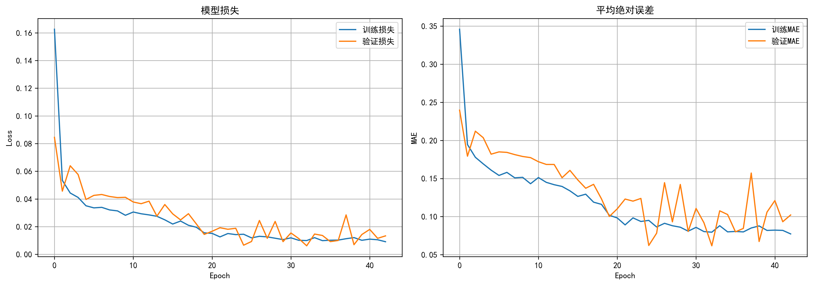
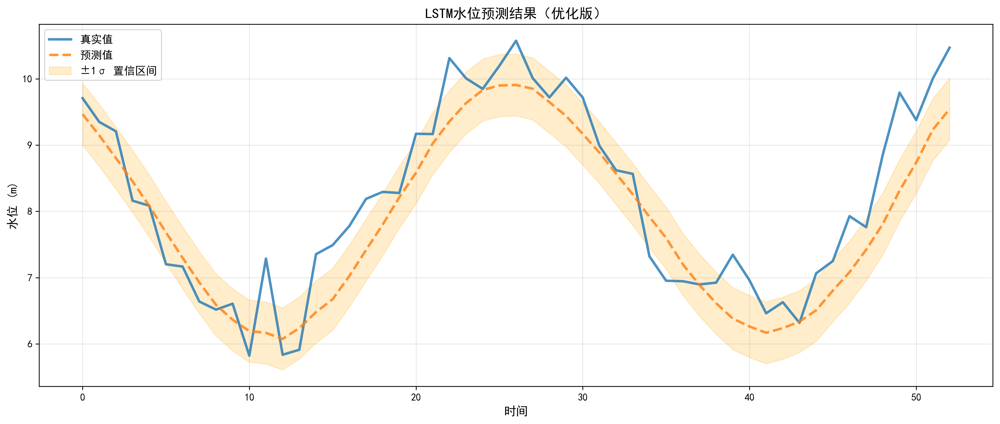
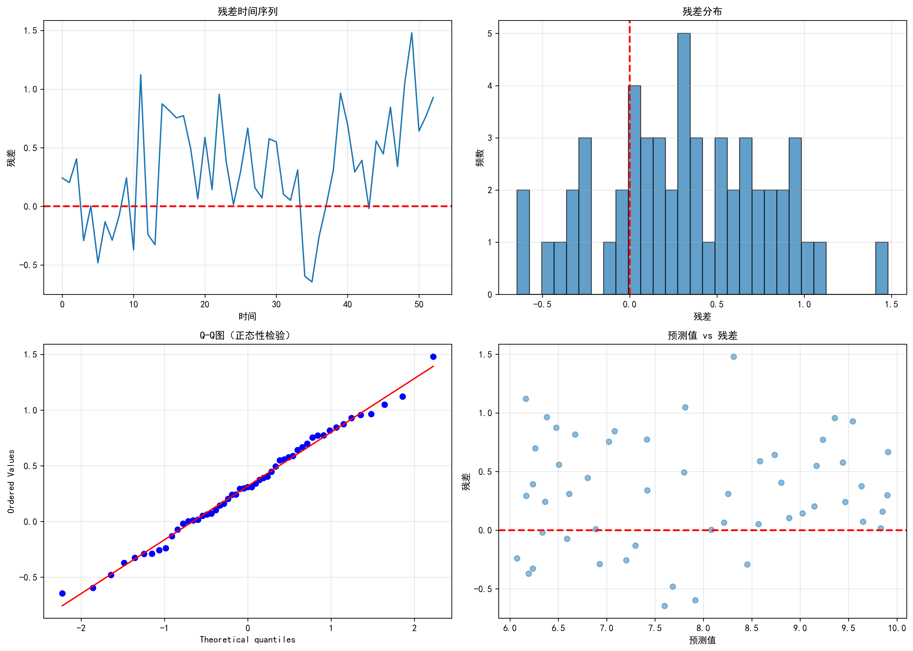

# smart-water-demo


> 面向智慧水利的洪水预警与决策支持系统 —— 全栈独立开发

---

## 项目简介

集成实时雨情监测、LSTM/GRU 深度学习预测、GIS 淹没模拟和应急决策支持，为流域防洪提供智能化解决方案。

## 核心功能

| 模块 | 说明 | 文件 |
|------|------|------|
| 数据预处理 | 缺失值处理、归一化、时序窗口构建 | `src/data_preprocessing.py` |
| LSTM 预测 | 基于 LSTM/GRU 的洪水过程预测 | `src/lstm_predictor.py` |
| KNN 预测 | KNN 回归辅助预测模型 | `src/knn_predictor.py` |
| 水情分析 | 水位趋势分析、异常检测 | `src/water_analysis.py` |
| 可视化 | Matplotlib 交互式图表 | `src/visualizer.py` |

## 预测效果





## 技术栈

| 层级 | 技术 |
|------|------|
| 深度学习 | TensorFlow / Keras · LSTM · GRU |
| 数据处理 | NumPy · Pandas · Scikit-learn |
| 后端 API | Flask REST |
| 前端 | Streamlit |
| 可视化 | Matplotlib · ECharts · GIS |
| 版本控制 | Git + GitHub |

## 项目结构

```
smart-water-demo/
├── src/
│   ├── data_preprocessing.py   # 数据预处理
│   ├── lstm_predictor.py       # LSTM 预测模型
│   ├── knn_predictor.py        # KNN 预测模型
│   ├── water_analysis.py       # 水情分析
│   └── visualizer.py           # 可视化工具
├── models/                     # 训练好的模型权重（.h5, .keras）
├── images/                     # 图表 & 截图
├── docs/                       # 开发文档 & 架构图
├── requirements.txt
└── README.md
```

## 快速开始

```bash
git clone https://github.com/LY-muyanshiqi/smart-water-demo.git
cd smart-water-demo
pip install -r requirements.txt
streamlit run src/water_analysis.py
```

## 相关项目

- [PCCP](https://github.com/LY-muyanshiqi/PCCP) — PCCP-E 环向变形智能预测
- [smart-water-projects](https://github.com/LY-muyanshiqi/smart-water-projects) — 智慧水利开源项目集
- [thermal-peak-shaving-pumped-storage](https://github.com/LY-muyanshiqi/thermal-peak-shaving-pumped-storage) — 抽水蓄能减碳优化
